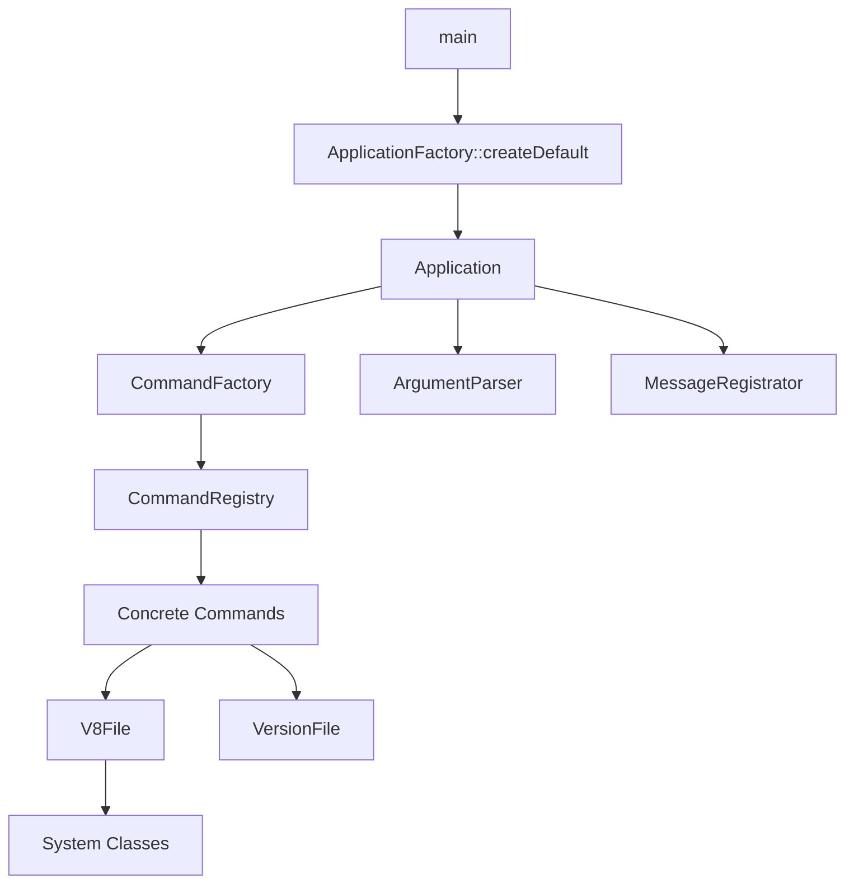
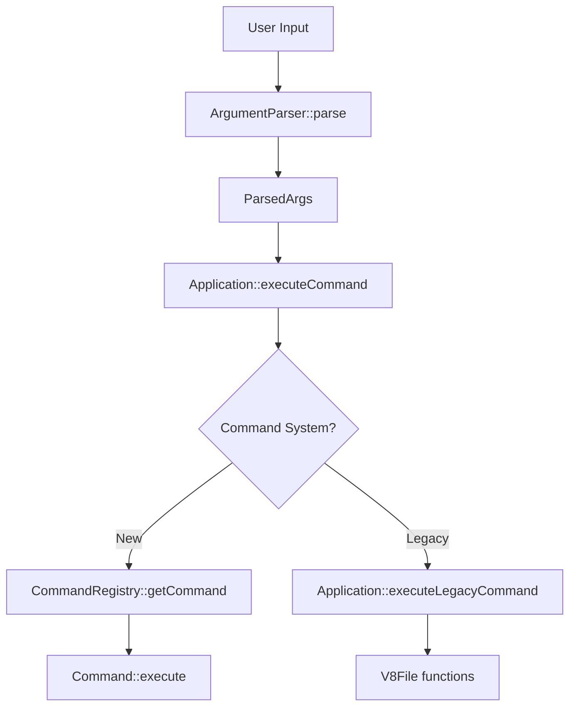
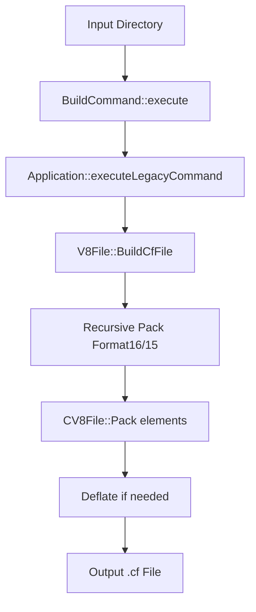

# Архитектура проекта V8Unpack

## Обзор

V8Unpack - это кросс-платформенная утилита для работы с файлами конфигурации 1C:Enterprise (.cf). Проект использует современную C++ архитектуру с применением SOLID принципов и паттернов проектирования.

## 🎯 SOLID Принципы

Проект строго следует принципам SOLID:

- **SRP (Single Responsibility)**: Каждый класс отвечает за одну функцию
- **OCP (Open-Closed)**: Расширение через наследование, не модификацию
- **LSP (Liskov Substitution)**: Наследники полностью заменяют базовые классы
- **ISP (Interface Segregation)**: Минимальные интерфейсы
- **DIP (Dependency Inversion)**: Зависимости от абстракций

## 🏗️ Архитектурные Слои

### 1. Presentation Layer (Уровень Презентации)

#### Application Layer (`src/app/`)

**Класс Application**
- Основной фасад приложения
- Координирует всю систему через паттерн Facade
- Реализует инициализацию компонентов и их жизненный цикл
- Методы:
  - `run()`: Точка входа приложения
  - `executeCoreLogic()`: Основная бизнес-логика
  - `executeCommand()`: Выполнение команд
  - `handleSpecialCases()`: Обработка специальных случаев (help, version)

**Класс ApplicationFactory**
- Фабрика для создания экземпляров Application
- Поддерживает Dependency Injection через `createWithComponents`
- Обеспечивает гибкость в конфигурировании приложения

**Класс ArgumentParser**
- Парсер командной строки
- Преобразует аргументы командной строки в структуру `ParsedArgs`
- Поддерживает POSIX-style опции (--key=value)
- Корректно обрабатывает legacy команды (-BUILD → build)

Структура `ParsedArgs`:
```cpp
struct ParsedArgs {
    std::string command;              // Имя команды
    std::vector<std::string> args;     // Позиционные аргументы
    std::map<std::string, std::string> options; // Опции (--key=value)
    std::string listFilePath;         // Путь к файлу списка команд
    bool hasListFile;                 // Флаг наличия batch файла
    std::string originalCommandLine;   // Исходная командная строка
};
```

#### Command Line Интерфейс (`src/commands/`)

**Абстрактный класс Command**
- Базовый класс для всех команд
- Определяет интерфейс команд через Strategy паттерн
- Виртуальные методы:
  - `execute()`: Выполнение команды
  - `getName()`: Имя команды
  - `getDescription()`: Описание команды
  - `showUsage()`: Помощь по команде

**Реализации команд:**
- `UnpackCommand`: Распаковка .cf файлов
- `PackCommand`: Упаковка директорий в .cf
- `ParseCommand`: Парсинг конфигураций в директории
- `BuildCommand`: Сборка конфигураций из директорий
- `ListCommand`: Список содержимого .cf файла
- Специализированные команды (Version, Help, Example, Bat)

**Класс CommandRegistry**
- Реестр команд по паттерну Registry
- Управляет жизненным циклом команд
- Предоставляет поиск и валидацию команд
- Методы:
  - `registerCommand()`: Регистрация команды
  - `getCommand()`: Получение команды по имени
  - `hasCommand()`: Проверка существования команды

**Класс CommandFactory**
- Фабрика команд (Factory Pattern)
- Создает конкретные реализации команд
- Эффективно управляет зависимостями (DI через logger)

**Интерфейс MessageRegistrator**
- Логирование и коммуникация с пользователем
- Разделение типов сообщений (ошибки, статус, информация)
- Внедрение зависимостей для тестирования

### 2. Business Logic Layer (Бизнес-логика)

#### Metadata Processing (`src/metadata/`)

**Класс MetadataAnalyzer**
- Анализ метаданных конфигураций
- Извлечение структурных элементов
- Поиск паттернов в конфигурациях

**Класс RegexRegistry**
- Реестр регулярных выражений
- Оптимизация поиска паттернов
- Кэширование скомпилированных выражений

#### File Operations (`src/fileops/`)

**Класс BatchProcessor**
- Групповая обработка файлов
- Поддержка сценариев автоматизации
- Управление очередями задач

### 3. Infrastructure Layer (Инфраструктура)

#### Core Utilities (`src/`)

**Класс V8File**
- Центральный класс для работы с V8 файлами
- Содержит CV8Elem для элементов файла
- Методы:
  - `LoadFileFromFolder()`: Загрузка из директории
  - `GetData()`: Сериализация в бинарный формат
  - `RecursiveUnpack()`: Рекурсивная распаковка

**Класс VersionFile**
- Управление версиями файлов
- Проверка совместимости
- Форматы версий (8.3.16+ vs устаревшие)

**Utility Classes:**
- `StringUtils`: Обработка строк
- `logger`: Логирование
- `ErrorCodes`: Систематизация ошибок

#### System Classes (`src/SystemClasses/`)

Набор cross-platform классов, имитирующих Delphi/C++Builder:
- `String`: Unicode строки
- `TStream` семейство: Работа с потоками
- `TMemoryStream`: In-memory буферы
- `TFileStream`: Файловые операции

#### Utils (`src/utils/`)

**Модуль ErrorCodes**
- Стандартизированные коды ошибок
- Читаемые сообщения об ошибках
- Локализация ошибок

**Модуль StringConverters**
- Конвертация между кодировками (UTF-8, UTF-16)
- Безопасные преобразования строк

### 4. Legacy Code Integration

#### Legacy Functions (`src/LegacyFunctions.h`)
- Обертки для legacy функций
- Постепенная миграция
- Поддержка обратной совместимости

### 5. Test Infrastructure (`test/`)

- `simple_test.cpp`: Базовые тесты
- `test_application.cpp`: Тесты приложения
- `test_metadata_parser.cpp`: Тесты парсинга метаданных

## 🔗 Взаимосвязи Классов

### Dependency Injection (DI)



### Command Execution Flow



### Data Flow в BuildCommand



## 🛡️ Улучшения Безопасности

### Security Audit (`doc/SECURITY_AUDIT_REPORT.md`)
- Анализ уязвимостей
- Hardening рекомендаций
- Best practices

### Архитектурные Защиты
- Input validation в ArgumentParser
- Memory safety в System Classes
- Exception handling в Application

## 🔄 Миграция и Совместимость

### Legacy Support
- `executeLegacyCommand()`: Обратная совместимость
- Gradual migration: Новые команды в новый фреймворк
- Command Bridge: Интеграция legacy функций

### Format Support
- V8 Format 8.3.16+ (Format16)
- Legacy Format 15
- Auto-detection версий
- Compatibility checks

## 📊 Производительность

### Оптимизации (`doc/OPTIMIZATION_REPORT.md`)
- Smart memory management
- Efficient compression
- Cached operations
- Lazy loading

## 🚀 Enterprise Features

### Production Ready
- Enterprise logging
- Centralized error handling
- Extensive testing coverage
- Professional documentation

### Extensibility
- Plugin architecture через commands
- Factory pattern для компонентов
- Registry pattern для управления
- Bridge pattern для интеграции

## 📋 Заключение

Архитектура V8Unpack представляет собой пример modern C++ enterprise приложения с полным набором SOLID принципов, паттернов проектирования и production-ready features. Полная миграция от monolithic подхода к component-based architecture обеспечивает scalability, maintainability и enterprise-grade quality.
